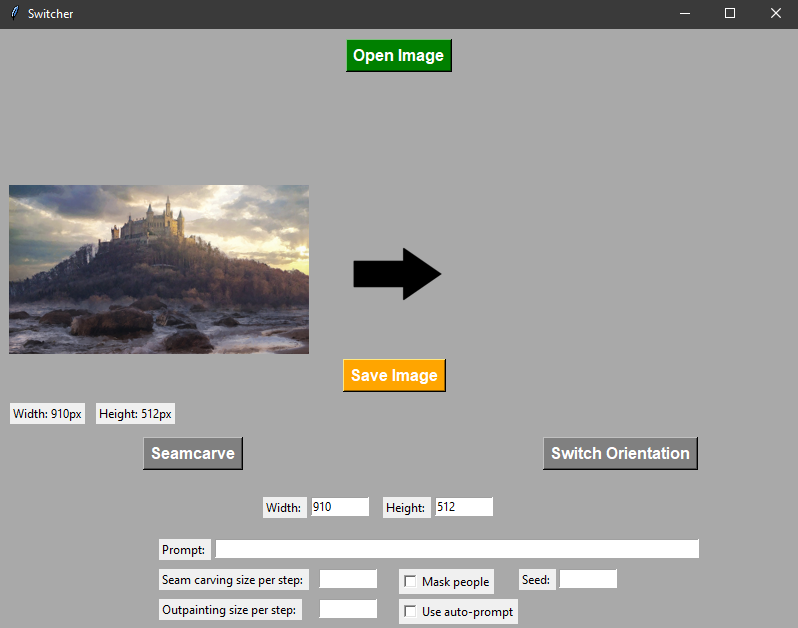
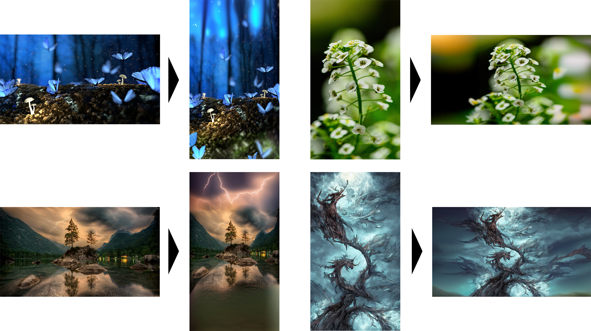

# Automatic Image switching

The code corresponding to the thesis "Automatically switching between portrait and landscape formats", including a small application with a GUI to test it.

## Requirements to run the code

* Python 3.10
* #### All the following python packages:
    * OpenCV
    * Pillow
    * NumPy
    * Numba
    * SciPy
    * Requests
    * Torch
    * YOLO from Ultralytics (only if testing automatic masks)
    * seam-carving by li-plus
    * brisque by rehanguha
* #### Automatic1111 ([Installation guide](https://stable-diffusion-art.com/install-windows/))
    - Stable Diffusion model ([Stable Diffusion v1-5](https://huggingface.co/runwayml/stable-diffusion-v1-5))
    - ControlNet model ([lllyasviel/control_v11p_sd15_inpaint](https://huggingface.co/lllyasviel/control_v11p_sd15_inpaint))

## How to run and test the application
- Run the Automatic1111 webUI as an API with (COMMANDLINE_ARGS= --api) in the .bat file
- Execute the gui.py file

- Start with opening an image to transform [Open Image button]

## Example results

## Acknowledgements

 - [Seam-carving package by li-plus](https://github.com/li-plus/seam-carving)
 - [Ultralytics](https://github.com/ultralytics/ultralytics)
 - [Automatic1111 API ControlNet usage](https://github.com/Mikubill/sd-webui-controlnet/wiki/API#integrating-sdapiv12img)